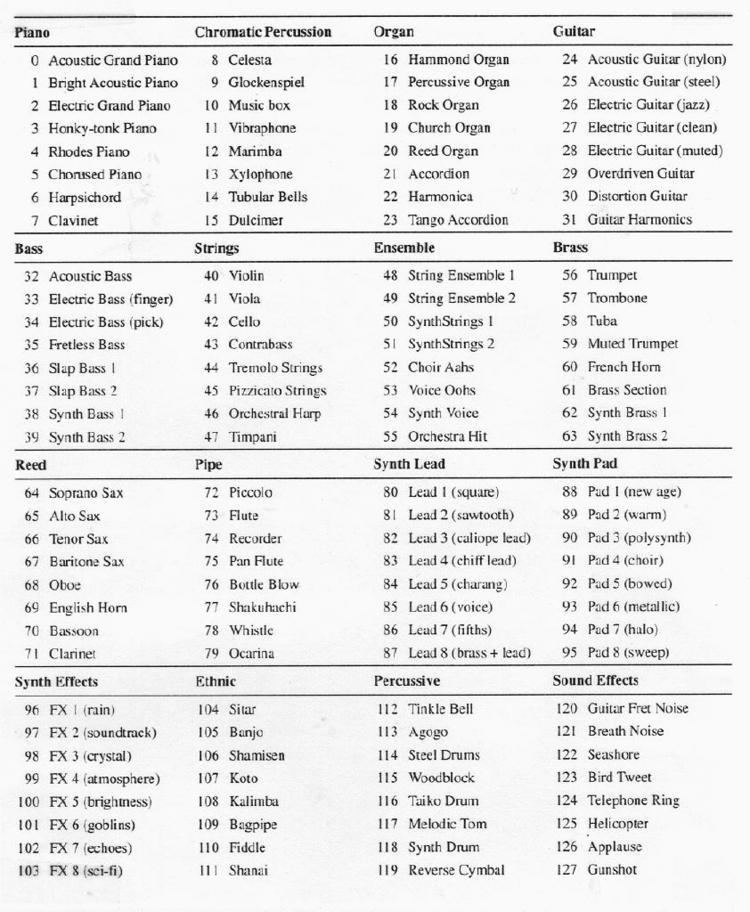

# Java Sound MIDI

Java sound kütüphanesi kullanarak müzik enstrümanlarını çalabiliriz.

## Enstrümanlar :

 
 
 ## Daha fazla bilgi
 
 - https://en.wikipedia.org/wiki/General_MIDI
 - https://newt.phys.unsw.edu.au/jw/notes.html
